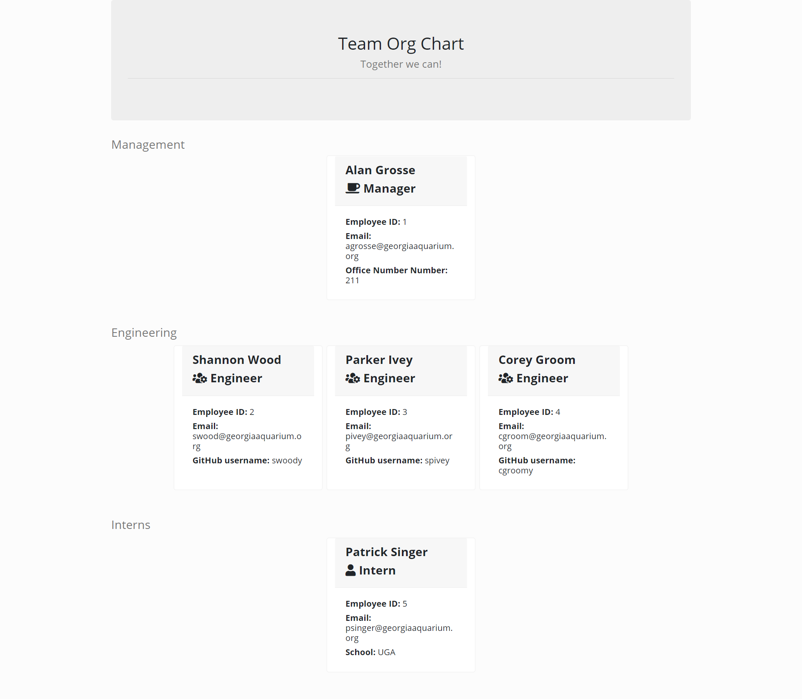
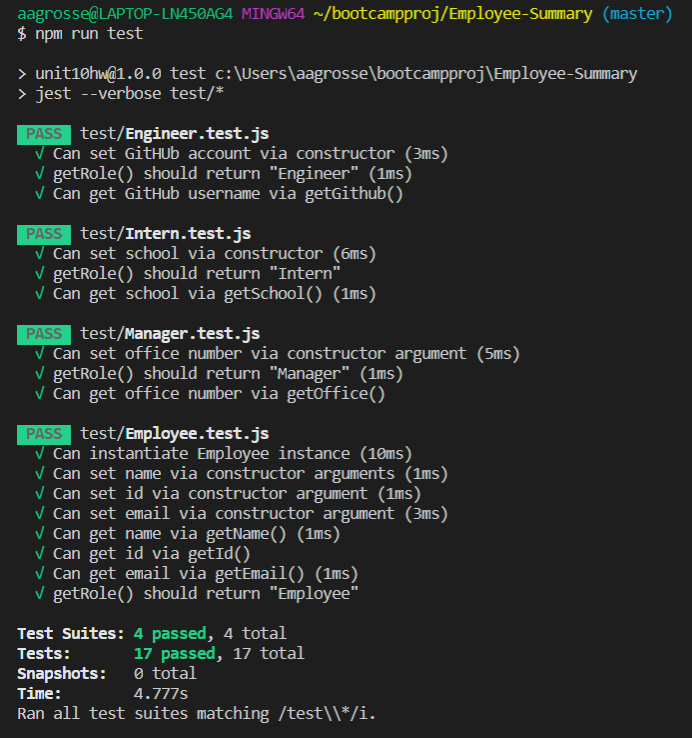

# Employee-Summary
A command line team generator application using Javascript, NPM modules, and Node.js

## User Story
As a manager, I want to generate a webpage that displays my teams basic info, so that i have quick access to emails and GitHub profiles.

# Screen Shots

## HTML Output

## Testing

# Usage
1. Clone the repo locally
2. Run npm install to get required npm packages
3. Run using entry point index.js - node index.js
4. Answer the command line prompts
5. Select Exit from the menu when all employees have been entered
6. Open the team.html file to view

# Links
[employee-summary](https://github.com/aagrosse/Employee-Summary)

